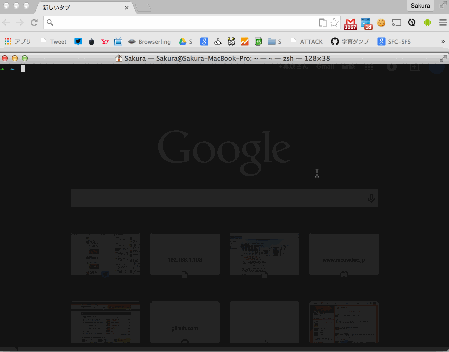

lw-remote
====
A script to get the remote dashboard url of Cerevo LiveWedge switcher.

This script required the iPad app.


Installation
----
This script can install via npm(node package manager).

You must be installed nodejs.

```sh
npm install -g lw-remote
```


Usage
----
```sh
$ lw-remote
? Cerevo LiveWedge IP Address: 192.168.1.94
[1/3] Connected Cerevo LiveWedge
[2/3] Request auth key and start streaming...
[3/3] Got auth key!
Remote dashboard url: https://shell.cerevo.com/remote/auth/****
```


